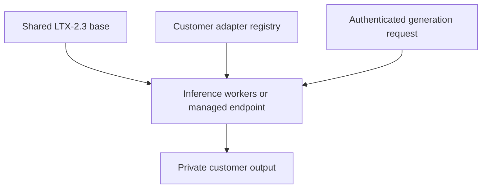
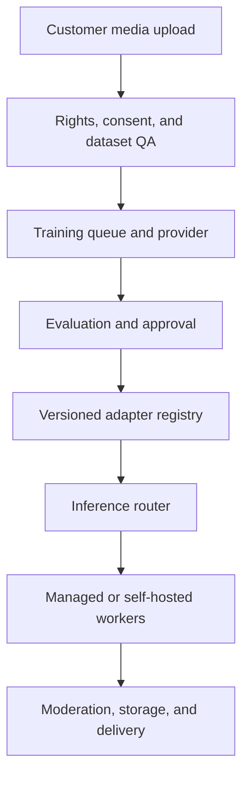

# LTX Trainer: CTO Feasibility Report

**Evidence update:** 15 July 2026
**Audience:** CTO, engineering, product, security, finance, and legal
**Decision:** Can a customer-facing platform create private LTX adapters and serve them economically, including realistic customer-specific talking-head video?
**Legal note:** Technical and commercial assessment only; obtain counsel for licensing decisions.

## 1. Executive decision and measured pilot evidence

**Yes, with conditions.** It is technically feasible to create a private LTX LoRA or IC-LoRA for each qualifying customer and serve it economically. The viable design is:

> **One shared LTX-2.3 base model, plus one or more small, private, versioned adapters for each customer.**

It is not economically or operationally sensible to maintain a separate 22-billion-parameter base checkpoint for every customer.

For an initial product, the recommended route is:

1. Use **fal-managed LTX training**.
2. Use **fal custom-LoRA inference** with the adapter selected per request.
3. Store an independent copy of every adapter, configuration, checksum, evaluation result, and base-model version.
4. Use **image-to-video LoRA training with 50% first-frame conditioning** as the default for customer characters, products, mascots, and recurring visual concepts.
5. Keep exact text, logos, captions, interface elements, and final branding in deterministic post-production rather than expecting the video model to reproduce them.
6. Introduce self-hosted inference only after real traffic demonstrates that it will reduce all-in cost by at least 30–50%.

### Important qualification: not every account should automatically receive a LoRA

The technically correct unit is **an adapter per reusable visual capability**, not necessarily one monolithic adapter per customer account.

A customer may need:

- No adapter, if reference-conditioned generation already meets the requirement.
- One product or character adapter.
- Separate product, persona, and visual-style adapters.
- An IC-LoRA for a repeatable transformation.
- Several adapters for unrelated product lines or campaigns.

Combining a person, product, background, and visual style into one undifferentiated adapter often reduces control and makes retraining difficult. Modular adapters are more defensible, and fal currently documents support for up to three supplied LoRAs on applicable quality endpoints.

### Overall verdict

| Dimension | Assessment | CTO interpretation |
|---|---:|---|
| Per-customer LoRA creation | 8/10 | Managed training exists and is inexpensive; dataset quality is the main constraint. |
| Per-customer full fine-tuning | 2/10 | Technically supported but unnecessary and uneconomic for normal customers. |
| Managed custom-LoRA inference | 8/10 | Confirmed endpoints, per-request adapter selection, and transparent usage pricing. |
| Adapter storage | 9/10 | Hundreds of megabytes per adapter is operationally manageable. |
| Output consistency | 6/10 | Useful improvement, not a guarantee of exact identity or product geometry. |
| Self-hosted inference | 6/10 | Feasible after benchmarking; cold starts, adapter switching, and GPU operations add complexity. |
| Multi-tenant production control plane | 5/10 | Straightforward in principle but requires real engineering around auth, queues, billing, deletion, and adapter lifecycle. |
| Commercial licensing | 3/10 until resolved | The model license contains a competitive-product restriction that requires written clarification for many customer-facing video products. |
| Overall | **Conditional go** | Approve a managed pilot; do not approve unrestricted commercial launch until licensing and measured quality are cleared. |

### Evidence update from the completed character pilot

The managed pilot materially narrows the conclusion:

| Question | Current answer | Evidence |
|---|---|---|
| Can a small private adapter be trained cheaply? | **Yes.** | One 500-step I2V LoRA completed for $1.20. The resulting adapter file was approximately 428 MB. |
| Does prompt-only generation preserve the person's identity? | **No, not in this smoke run.** | The prompt-only output depicted a different person. |
| Does a supplied first frame improve identity? | **Yes, in one short sample.** | The 3.7-second I2V sample retained the reference identity much better, while also retaining much of the original setting. This is a single-sample observation, not production validation. |
| Did the tested LTX route produce indistinguishable speaking footage? | **No.** | The 11-second supplied-audio output showed unstable/deformed mouth shapes, jaw and cheek warp, unnatural eye/expression changes, and synthetic facial texture. It is rejected as obviously AI. |
| Was that a fair test of an A2V-trained LoRA? | **No.** | The adapter was trained with the I2V endpoint and `with_audio: false`; it received no synchronized audio-to-facial-motion supervision. Passing it to an A2V inference endpoint does not convert it into an A2V-trained adapter. |
| Is a correct A2V experiment still possible? | **Yes, but unproven.** | LTX and fal document a dedicated A2V trainer using a start image, frozen synchronized audio, and matching target video. A new paired dataset and held-out blind evaluation are required. |
| Is preservation-first lip editing more realistic? | **Promising, not proven.** | A separate genuine-footage control preserved the upper face/background strongly and localized edits to the lower face, but measurable mouth/lower-face smoothing and questionable dental texture prevent an indistinguishability claim. |

The measured pilot cost ledger is:

| Operation | Cost |
|---|---:|
| I2V LoRA training, 500 steps | $1.2000 |
| Prompt-only LoRA inference | $0.1099 |
| Reference-conditioned LoRA inference | $0.1099 |
| Supplied-audio LoRA inference | $0.3272 |
| Preservation-first real-video control | $1.4667 |
| **Successful completed operations** | **$3.2137** |
| Validation-rejected request retained conservatively | $0.3272 |
| **Conservative committed total** | **$3.5409** |
| **Remaining under the $12 cap** | **$8.4591** |

The current fal pages list I2V training at $0.0024 per step, A2V training at $0.006 per step, and distilled custom-LoRA inference at $0.001405 per generated megapixel-frame. These are provider prices, not accepted-output costs; retries and creative rejection multiply COGS. [fal I2V trainer](https://fal.ai/models/fal-ai/ltx23-trainer-v2/i2v), [fal A2V trainer](https://fal.ai/models/fal-ai/ltx23-trainer-v2/a2v), [fal custom-LoRA inference](https://fal.ai/models/fal-ai/ltx-2.3-22b/distilled/image-to-video/lora)

### Correct talking-head conclusion

The completed adapter is valid only as a small I2V character smoke test. It is a **no-go for indistinguishable talking-head speech** because:

1. It used the I2V trainer, not the dedicated A2V trainer.
2. Audio was explicitly disabled during training.
3. The 30-example training set was dominated by full-body or medium activity shots; only one caption described speech and only one described a close-up.
4. Three published generations do not establish identity or location generalization.
5. The actual supplied-audio output failed the user's visual quality bar.

The next fair LTX test is an approval-gated 1,000-step A2V experiment using exact synchronized start-image/audio/target-video groups. The endpoint's documented 2,000-step default costs $12; the capped plan uses 1,000 steps ($6) and explicitly treats the result as R&D, not a promised fix. See [A2V experiment plan](A2V_EXPERIMENT_PLAN.md).

The broader 74-file source inventory is also dominated by full-body or medium activity footage. Existing contact sheets do not yet prove that ten qualifying close-speaking groups with visible teeth/inner-mouth coverage are available. This is a **data gate, not a hyperparameter problem**: do not submit A2V training until the remaining download or new purpose-recorded footage fills that gap.

### Current CTO verdict

| Scope | Verdict |
|---|---|
| Shared LTX base plus private customer adapters | **Technically feasible** |
| Managed I2V character/product personalization | **Conditional pilot go** |
| Current 500-step I2V adapter for undetectable talking heads | **No-go** |
| New correctly paired A2V LoRA | **Unproven R&D; approval-gated** |
| Preservation-first exact-speech footage | **Preferred near-term route, pending blind review** |
| Arbitrary new locations at the stated zero-detection bar | **Not demonstrated** |
| Commercial launch | **Blocked on written license/legal clearance and measured quality** |

---

## 2. What LTX Trainer actually creates

LTX Trainer customizes LTX-2/LTX-2.3 using three relevant methods:

| Method | What changes | Best use | Per-customer recommendation |
|---|---|---|---|
| LoRA | Trains low-rank adapter weights while preserving the base | Character, product, mascot, visual style, or recurring motion behavior | **Recommended default** |
| IC-LoRA | Learns a reference-conditioned input-to-output capability | Relighting, restoration, colorization, pose/depth/edge control, or repeatable V2V transformation | Use only when paired data exists |
| Full fine-tune | Updates the full model | Large domain shift with extensive proprietary data | Avoid for ordinary customers |

The current trainer supports LoRA training, full fine-tuning, and a broad conditioning framework covering text-to-video, image-to-video, video extension, video-to-video, audio-to-video, video-to-audio, audio generation and extension, inpainting/outpainting, and joint audio-video reference workflows. [Official trainer README](https://github.com/Lightricks/LTX-2/blob/main/packages/ltx-trainer/README.md)

The LTX Trainer product page describes training for characters, styles, workflows, products, and intellectual property, with video, audio, cross-modal, first-frame, reference, mask, prefix, and suffix conditioning. It also states that trained weights can be used locally, in ComfyUI, or through compatible hosted endpoints. [LTX Trainer](https://ltx.io/model/ltx-trainer)

### Recommended mapping

| Requirement | Recommended approach |
|---|---|
| Animate a known character or product from an approved first frame | I2V LoRA, first-frame probability 0.5 |
| Prompt-only visual concept or style | T2V LoRA |
| Both I2V and T2V from one adapter | I2V LoRA with mixed first-frame conditioning |
| Repeatable before-to-after video transformation | V2V IC-LoRA with aligned pairs |
| Exact logo, packaging label, typography, or interface | Model-generated substrate plus deterministic compositing |
| One image and immediate generation | Reference-conditioned I2V; do not promise meaningful custom training |

---

## 3. Recommended customer model: shared base plus modular adapters

### Correct architecture



The base model is loaded once per worker or supplied by the managed provider. The request selects a private adapter associated with the authenticated customer.

### Incorrect architecture

Avoid:

- A complete LTX base checkpoint per customer.
- A permanently running GPU per customer.
- Customer-supplied arbitrary adapter URLs.
- One blended adapter containing every person, product, style, and environment associated with a customer.
- Treating a filesystem name or request field as proof of adapter ownership.

### Adapter granularity

Prefer logical adapter types such as:

```text
persona
product
product_line
mascot
visual_style
motion_style
transformation
```

Each adapter should be immutable once activated. Retraining creates a new version, and the active pointer changes only after evaluation and approval.

---

## 4. Model and artifact footprint

The official LTX-2.3 repository currently shows approximately:

- **46.1 GB** for the development checkpoint.
- **46.1 GB** for the distilled checkpoint.
- **7.61 GB** for the shared high-rank distilled LoRA.
- Approximately **201 MB** for an official rank-32 creative LoRA example.
- Official IC-LoRA examples in the hundreds-of-megabytes range, including approximately 327 MB and 654 MB examples.

Sources: [official LTX-2.3 files](https://huggingface.co/Lightricks/LTX-2.3/tree/main), [rank-32 LoRA example](https://huggingface.co/Lightricks/LTX-2.3-22b-LoRA-Cinemagraph/tree/main), [IC-LoRA example](https://huggingface.co/Lightricks/LTX-2.3-22b-IC-LoRA-Motion-Track-Control/tree/main).

For capacity planning, budget approximately **0.2–1 GB per customer adapter**, while allowing exceptions.

| Customers/adapters | Planning storage at 0.2 GB | Planning storage at 1 GB |
|---:|---:|---:|
| 100 | 20 GB | 100 GB |
| 1,000 | 200 GB | 1 TB |
| 10,000 | 2 TB | 10 TB |

Storage is unlikely to be the dominant expense. Generated video, source datasets, human quality assurance, retry volume, and support will normally cost more.

Fal’s quality custom-LoRA API currently documents up to three supplied LoRAs per request and a maximum size of 3 GB per adapter. [fal quality I2V LoRA API](https://fal.ai/models/fal-ai/ltx-2.3-quality/image-to-video/lora/api)

---

## 5. Dataset requirements and preprocessing

### Open-source dataset contract

The official trainer accepts CSV, JSON, or JSONL metadata. Relevant fields include:

```text
video             or legacy media_path
audio
caption
reference_video   or legacy ref_media_path
reference_audio
video_mask
audio_mask
```

A minimal JSON dataset can look like:

```json
[
  {
    "caption": "CUSTOMTOKEN red running shoe rotating on a studio pedestal",
    "video": "videos/001.mp4"
  }
]
```

The preprocessing stage caches video latents, audio latents, text embeddings, references, and masks. The trigger token must be applied consistently during preprocessing and production prompting. [Official dataset preparation guide](https://github.com/Lightricks/LTX-2/blob/main/packages/ltx-trainer/docs/dataset-preparation.md)

### Resolution and frame constraints

Training buckets require:

- Width divisible by 32.
- Height divisible by 32.
- Frame count satisfying `frames % 8 == 1`.

Valid frame counts include:

```text
1, 9, 17, 25, 33, 41, 49, 57, 65, 73, 81, 89, 121
```

Representative buckets from the documentation include:

| Objective | Example bucket | Trade-off |
|---|---:|---|
| Subject/product fidelity | `768x448x89` | Higher detail, shorter temporal coverage |
| Motion learning | `512x512x121` | More frames, lower spatial detail |
| Short high-detail clip | `960x544x49` | More spatial cost, fewer frames |
| Still image | `960x544x1` | Appearance only; does not teach motion |

The approximate video token sequence length is:

\[
\frac{H}{32}\times\frac{W}{32}\times\left(\frac{F-1}{8}+1\right)
\]

For example, `768x448x89` produces 4,032 sequence tokens. This explains why increasing both resolution and duration quickly creates memory pressure.

The preprocessing pipeline preserves aspect ratio, center-crops, and takes the first configured number of frames. Incorrect framing or important content near the edge can therefore be lost during preprocessing.

### Minimum practical dataset

For a production subject/product/style adapter:

- **Experimental minimum:** approximately 10 clean files.
- **Practical target:** 20–50 varied examples.
- **Preferred starting point:** around 50 examples with 3–4 held out for evaluation.
- Use short clips, commonly around four to eight seconds, when motion matters.
- Include multiple angles, environments, distances, actions, lighting conditions, and backgrounds.
- Keep captions accurate and specific.
- Avoid making every example share the same background, pose, or camera movement.

Images can teach appearance but not temporal behavior. A customer supplying only a few images should normally use reference-conditioned generation before being sold a custom training product.

### Captioning requirements

Captions should distinguish:

- The reusable subject or product.
- The action or motion.
- Camera movement.
- Environment and lighting.
- Attributes that should vary versus attributes that should remain fixed.

Automatic captioning must be reviewed. Hallucinated captions teach incorrect correlations and can make the adapter memorize backgrounds or ignore prompts.

### Managed fal dataset differences

Fal’s managed trainer uses a simpler archive contract:

- One archive containing images **or** videos, not a mixture.
- Optional captions with the same base filename as each media file.
- At least 10 examples; 20–50 varied examples are the safer target.
- Rank choices of 8, 16, 32, 64, or 128; default 32.
- Default 89 frames at 24 fps.
- Low, medium, and high resolution buckets across common aspect ratios.
- Automatic scene splitting and input scaling options.
- Audio auto-detection that effectively requires consistent audio availability across the dataset.

Source: [fal LTX-2.3 I2V trainer](https://fal.ai/models/fal-ai/ltx23-trainer-v2/i2v) and [fal LTX-2.3 T2V trainer](https://fal.ai/models/fal-ai/ltx23-trainer-v2/t2v).

### IC-LoRA dataset difficulty

IC-LoRA requires aligned input/reference and target examples representing the transformation to learn. This makes it significantly harder to productize than a normal subject/style adapter. A customer should not be offered IC-LoRA unless the transformation recurs frequently and suitable paired examples can be produced consistently.

---

## 6. Training configuration

### Open-source executable baseline

The official repository configurations currently use approximately:

| Parameter | Standard baseline |
|---|---:|
| Rank / alpha | 32 / 32 |
| Dropout | 0 |
| Learning rate | `1e-4` |
| Steps | 2,000 |
| Batch size | 1 |
| Gradient accumulation | 1 |
| Optimizer | AdamW |
| Scheduler | Linear |
| Precision | BF16 |
| Gradient checkpointing | Enabled |
| Checkpoint interval | 250 steps |
| I2V first-frame probability | 0.5 |

The default validation configuration is optimized for speed, not necessarily production quality. Current repository examples use a smaller validation resolution and fixed seed so training progress can be inspected consistently. [Official trainer configurations](https://github.com/Lightricks/LTX-2/tree/main/packages/ltx-trainer/configs)

### Newer official tuning guidance

LTX’s newer first-LoRA tutorial gives a somewhat different practical starting point:

- Approximately 50 examples.
- Hold out 3–4 examples.
- Rank/alpha 32/32.
- Around 1,000 steps.
- Learning rate around `1.5e-4`.
- Cosine schedule.
- Inspect intermediate checkpoints and stop before overfitting.

Source: [Training your first LoRA on LTX](https://ltx.io/blog/training-your-first-lora-on-ltx).

These are not contradictory guarantees. The repository YAML is an executable baseline, while the tutorial is practical tuning guidance. A production system should save and evaluate checkpoints at approximately 250, 500, 750, and 1,000 steps, continuing toward 2,000 only when the model remains underfit.

### Managed fal baseline

Fal’s current default configuration is approximately:

| Parameter | Managed default |
|---|---:|
| Rank | 32 |
| Steps | 2,000 |
| Learning rate | `2e-4` |
| Frames | 89 |
| FPS | 24 |
| Resolution | Medium |
| I2V first-frame probability | 0.5 |

Fal exposes fewer internal controls than the open-source trainer. It does not expose arbitrary target modules, optimizer/scheduler selection, checkpoint selection, or every preprocessing option. The trade-off is substantially lower operational burden.

### Hardware for self-managed training

Official guidance currently recommends:

- Linux with CUDA.
- CUDA 13+ for best performance.
- An NVIDIA GPU with 80 GB or more VRAM for the standard configuration.
- A low-VRAM route for approximately 32 GB GPUs using INT8 quantization, an 8-bit optimizer, lower rank, text-encoder quantization, and optimizer offloading.

Full fine-tuning is much more demanding and can require multiple 80 GB H100-class GPUs. For per-customer personalization, LoRA is the economically rational path. [Official trainer requirements](https://github.com/Lightricks/LTX-2/blob/main/packages/ltx-trainer/README.md)

---

## 7. Training economics

Current fal managed-training prices are:

| Training mode | Listed rate | Default steps | Default compute cost |
|---|---:|---:|---:|
| I2V LoRA | $0.0024/step | 2,000 | **$4.80** |
| T2V LoRA | $0.0060/step | 2,000 | **$12.00** |
| V2V IC-LoRA | $0.0059/step | 3,000 | **$17.70** |
| A2V | $0.0060/step | Configuration dependent | Configuration dependent |
| Joint AV IC-LoRA | $0.0068/step | Configuration dependent | Configuration dependent |

Sources: [fal I2V trainer](https://fal.ai/models/fal-ai/ltx23-trainer-v2/i2v), [fal T2V trainer](https://fal.ai/models/fal-ai/ltx23-trainer-v2/t2v), and [fal V2V trainer](https://fal.ai/models/fal-ai/ltx23-trainer-v2/v2v).

### Fleet training cost

| Adapters | I2V default | T2V default | V2V default |
|---:|---:|---:|---:|
| 100 | $480 | $1,200 | $1,770 |
| 1,000 | $4,800 | $12,000 | $17,700 |
| 10,000 | $48,000 | $120,000 | $177,000 |

At a 20% completed-run retraining rate, multiply by 1.2. A completed but poor-quality adapter is normally still billable, so quality-driven retraining must be included in planning.

### The real onboarding cost

The managed GPU run is cheap. More expensive components can include:

- Rights and consent review.
- Media collection.
- Scene selection.
- Caption review.
- Deduplication.
- Customer support.
- Evaluation and approval.
- Retraining and version management.

If dataset preparation requires several hours of specialist work per customer, the low GPU price does not create a low-cost product. Automation and strict eligibility criteria are essential.

---

## 8. Inference deployment options

### Option A: fal managed custom-LoRA inference

This is the recommended MVP path.

Advantages:

- Custom LoRA supplied per request.
- No GPU operations.
- Serverless scaling.
- Transparent megapixel-frame pricing.
- Distilled, full, and quality routes.
- Webhook-compatible asynchronous workflow.
- Up to three adapters documented on applicable quality endpoints.

Disadvantages:

- Provider dependency.
- External processing of customer assets.
- Concurrency and regional-processing questions.
- Price changes.
- Adapter-download/caching behavior must be confirmed.
- Provider outage or model revision can affect the product.

### Option B: official LTX public API

The current public LTX async video-generation schema documents prompt, model, duration, resolution, frame rate, audio, and camera controls, but it does not document a request field for arbitrary private LoRA adapters. [Official LTX API reference](https://docs.ltx.video/api-documentation/api-reference/async-video-generation/submit-text-to-video)

Therefore, do not assume the public LTX API can dynamically serve every customer adapter. It may become an option through a separate enterprise agreement, but fal or self-hosting is the confirmed path for arbitrary customer LoRAs.

### Option C: self-hosted LTX inference

Potentially attractive at sustained volume or for strict privacy requirements, but operationally more complex.

Requirements include:

- Warm base-model workers.
- GPU scheduling.
- Adapter registry and cache.
- Safe adapter load/unload behavior.
- Isolation between customers.
- Queueing and autoscaling.
- Model-version management.
- Observability and incident response.
- Burst or fallback capacity.

The native LTX loader documents applying/fusing LoRAs during model construction. It does not promise vLLM-style, request-level hot swapping with concurrent tenant isolation. This must be benchmarked before designing high-density multi-adapter workers. [LTX Core documentation](https://github.com/Lightricks/LTX-2/blob/main/packages/ltx-core/README.md)

---

## 9. Managed inference economics

Current fal custom-LoRA pricing is based on generated megapixel-frames:

- Distilled: **$0.001405 per megapixel-frame**.
- Full 22B: **$0.001805 per megapixel-frame**.
- Quality: **$0.0027075 per megapixel-frame**.

Sources: [Distilled LoRA inference](https://fal.ai/models/fal-ai/ltx-2.3-22b/distilled/image-to-video/lora), [Full 22B LoRA inference](https://fal.ai/models/fal-ai/ltx-2.3-22b/image-to-video/lora), and [Quality LoRA inference](https://fal.ai/models/fal-ai/ltx-2.3-quality/image-to-video/lora).

The billing formula is:

\[
C_{clip}=r\times\frac{W\times H\times F}{1,000,000}
\]

where:

- `r` is the endpoint rate.
- `W` and `H` are returned dimensions.
- `F` is generated frame count.

At 24 fps, the LTX-valid frame counts 121, 241, and 481 correspond approximately to five, ten, and twenty seconds from first frame to last frame.

### Cost per raw generation

| Tier | 5s 720p | 10s 720p | 20s 720p | 5s 1080p | 10s 1080p | 20s 1080p |
|---|---:|---:|---:|---:|---:|---:|
| Distilled | $0.1567 | $0.3121 | $0.6228 | $0.3525 | $0.7021 | $1.4013 |
| Full 22B | $0.2013 | $0.4009 | $0.8001 | $0.4529 | $0.9020 | $1.8003 |
| Quality | $0.3019 | $0.6014 | $1.2002 | $0.6793 | $1.3530 | $2.7005 |

These are nominal calculations. The provider bills actual returned width, height, and frames. Padding to model-compatible dimensions can create a small difference.

The custom-LoRA API does not publicly guarantee every 20-second frame-count combination. Production must test 481-frame requests; otherwise use shorter generation plus extension.

### Retry and acceptance multiplier

A technically successful but creatively rejected generation is still a paid generation.

Define:

\[
A=\frac{\text{paid generation attempts}}{\text{accepted customer outputs}}
\]

Examples:

- `A = 1.0`: every output is accepted.
- `A = 1.25`: 80% effective acceptance.
- `A = 1.5`: 66.7% effective acceptance.
- `A = 2.0`: 50% effective acceptance.
- `A = 3.0`: three paid attempts per accepted output.

The accepted-output compute cost is:

\[
C_{accepted}=A\times C_{clip}
\]

For a five-second 1080p Full 22B output:

| Attempts per accepted output | Compute cost |
|---:|---:|
| 1.0 | $0.453 |
| 1.5 | $0.679 |
| 2.0 | $0.906 |
| 3.0 | $1.359 |

The retry/acceptance factor is more important to gross margin than adapter storage.

---

## 10. Multi-customer monthly scenarios

### Scenario assumptions

- 10 accepted outputs per active customer per month.
- Each output is five seconds.
- 1.5 paid attempts per accepted output.
- Inference only; excludes training, storage, support, moderation, egress, taxes, and engineering.

### Monthly managed inference

| Active customers | Distilled 720p | Full 720p | Quality 720p | Distilled 1080p | Full 1080p | Quality 1080p |
|---:|---:|---:|---:|---:|---:|---:|
| 100 | $235 | $302 | $453 | $529 | $679 | $1,019 |
| 1,000 | $2,350 | $3,019 | $4,529 | $5,288 | $6,793 | $10,190 |
| 10,000 | $23,501 | $30,192 | $45,288 | $52,878 | $67,933 | $101,899 |

### General planning formula

Let:

- `N` = active customers.
- `K` = accepted outputs per customer.
- `A` = paid attempts per accepted output.
- `Cclip` = raw generation price.
- `B` = completed training runs per newly trained customer.
- `Ctrain` = training cost.

Then:

\[
MonthlyCost=N\times(K\times A\times C_{clip}) + NewCustomers\times(B\times C_{train})
\]

For recurring months with no retraining, the second term is zero.

### Implication

Managed inference remains practical at thousands of customers, but it is not free. A product must use:

- Resolution and duration limits.
- Preview versus final-quality tiers.
- Credit-based usage.
- Explicit retraining allowances.
- No unlimited-generation plan unless strict fair-use and throttling make the economics safe.

---

## 11. Recommended preview/final routing

Use a two-tier render strategy:

### Preview

- Distilled endpoint.
- 720p.
- Short duration.
- Generate one or two candidates.
- Customer chooses direction.

### Final

- Full or Quality endpoint.
- Higher resolution only after approval.
- Preserve prompt, seed, adapter version, first frame, and configuration.
- Apply exact logos, captions, and text in post-production.

This avoids paying quality-tier cost for ideas the customer will reject before close inspection.

---

## 12. Self-hosting economics

### Current reference GPU rates

RunPod currently lists approximately:

- Secure RTX 5090 32 GB: **$0.99/hour**, or about $722.70 for 730 hours.
- Secure A100 PCIe 80 GB: **$1.39/hour**, or about $1,014.70 for 730 hours.
- Serverless RTX 5090: **$1.58/hour**.
- Serverless A100 80 GB: **$2.72/hour**.
- Serverless H100: **$4.55/hour**.

Source: [RunPod pricing](https://www.runpod.io/pricing).

Modal currently lists approximately $2.50/hour for an A100 80 GB and $3.95/hour for an H100 before other resources. [Modal pricing](https://modal.com/pricing)

### Conservative hardware assumptions

- Treat a 32 GB RTX 5090 as a distilled/quantized candidate, not a guaranteed full-quality host.
- Treat an 80 GB A100 or H100 as the conservative baseline for full/quality benchmarking.
- Do not commit to hardware until the exact model, quantization, resolution, frames, audio path, and adapter stack have been tested.

### Always-on compute-only break-even

Ignoring engineering, storage, failures, and operational overhead:

| Always-on worker | Comparable fal request | Approximate break-even attempts/month |
|---|---|---:|
| Secure 5090, $722.70/month | Distilled 5s 720p | 4,613 |
| Secure A100, $1,014.70/month | Full 5s 720p | 5,041 |
| Secure A100, $1,014.70/month | Full 5s 1080p | 2,241 |
| Secure A100, $1,014.70/month | Quality 5s 720p | 3,361 |
| Secure A100, $1,014.70/month | Quality 5s 1080p | 1,494 |

At 10 accepted clips/customer/month and `A = 1.5`, divide attempts by 15:

- Distilled 5s 720p: approximately 308 active customers.
- Full 5s 1080p: approximately 149 active customers.
- Quality 5s 1080p: approximately 100 active customers.

These are only mathematical compute crossings. They do not establish that self-hosting is cheaper after staffing, idle capacity, failures, and provider fallback.

### Serverless billed-time break-even

Let `T` include:

- Cold start.
- Model loading.
- Adapter loading/fusion.
- Inference.
- Encoding.
- Billed idle timeout.

At current RunPod serverless prices, maximum compute time before exceeding the comparable fal request is approximately:

| Worker | Request | Maximum total billed time |
|---|---|---:|
| 5090 | Distilled 5s 720p | ~357 seconds |
| A100 | Full 5s 720p | ~266 seconds |
| A100 | Full 5s 1080p | ~599 seconds |
| A100 | Quality 5s 720p | ~400 seconds |
| A100 | Quality 5s 1080p | ~899 seconds |

No trustworthy official end-to-end benchmark covers every LTX-2.3 LoRA configuration. A real benchmark is mandatory before claiming a unit-cost advantage.

### Practical migration threshold

Benchmark self-hosting when one or more are true:

- Managed inference is consistently approximately $2,000–$5,000 per month.
- The workload is predictable enough to maintain useful GPU utilization.
- Privacy, data-residency, or enterprise requirements justify operational complexity.
- Provider latency or concurrency is blocking growth.

Migrate only if the benchmark demonstrates at least 30–50% all-in savings while meeting latency, quality, reliability, and security targets.

### Likely long-term design

A hybrid design is often best:

- Warm self-hosted pool for steady traffic.
- Managed fal capacity for spikes, outages, deployments, and overflow.
- One common adapter registry and request contract.

---

## 13. Production control-plane architecture



### Required durable entities

#### Customers

```text
id
account_id
plan
data_region
consent_policy_version
status
created_at
```

#### Datasets

```text
id
customer_id
purpose
source_manifest_uri
dataset_sha256
media_type
sample_count
held_out_count
rights_attestation_id
quality_report
retention_until
status
created_at
```

#### Adapters

```text
id
customer_id
logical_name
adapter_type
base_model
base_revision
artifact_uri
artifact_sha256
rank
training_steps
training_fps
training_frames
resolution_bucket
trigger_phrase
recommended_strength
status
evaluation_version
evaluation_score
created_at
activated_at
superseded_by
deleted_at
```

#### Training jobs

```text
id
customer_id
dataset_id
adapter_id
provider
provider_job_id
idempotency_key
config_json
reserved_cost
actual_cost
status
error_class
started_at
completed_at
```

#### Generation attempts

```text
id
customer_id
adapter_version_id
provider
provider_job_id
idempotency_key
prompt_hash
input_asset_ids
width
height
frames
fps
quality_tier
seed
reserved_cost
actual_cost
status
accepted_output
moderation_status
created_at
```

### Adapter lifecycle

```text
draft
→ dataset_processing
→ dataset_ready
→ training_queued
→ training
→ validating
→ awaiting_customer_approval
→ active
→ superseded | failed | deleting | deleted
```

### Generation lifecycle

```text
created
→ cost_reserved
→ queued
→ provider_submitted
→ processing
→ validating
→ moderation
→ complete | failed | canceled | refunded
```

---

## 14. Job orchestration and reliability

The customer-facing API should be asynchronous.

Recommended flow:

1. Authenticate customer and authorize adapter.
2. Validate request parameters.
3. Calculate maximum cost and reserve credits.
4. Enqueue the request with an idempotency key.
5. Submit to provider and persist provider job ID.
6. Process signed webhook or resilient polling.
7. Validate returned file and metadata.
8. Run moderation and output checks.
9. Finalize provider cost.
10. Release unused reservation.
11. Store output and notify customer.

### Retry taxonomy

Do not retry every error identically.

| Error class | Typical response |
|---|---|
| Invalid media/configuration | Fail without retry; return actionable error |
| Moderation rejection | Fail without automatic retry |
| Provider quota/rate limit | Backoff and retry or route to fallback |
| Provider 5xx/transient | Retry with idempotency and job reconciliation |
| Client timeout | Check provider job before resubmitting |
| Download/encoding failure after successful generation | Retry download/processing, not generation |
| Adapter incompatibility | Disable adapter version and route to known-safe path |

A timeout is not proof that the provider did not start a billable job. Persist provider job IDs before retrying to avoid duplicate paid generations.

### Operational controls

- Per-customer concurrency limits.
- Global provider concurrency limits.
- Fair queue scheduling.
- Dead-letter queue.
- Cancellation.
- Backpressure.
- Circuit breakers.
- Provider fallback.
- Cost-anomaly alerts.
- p50/p95 queue and generation latency.
- Success, retry, creative-rejection, and moderation rates.

---

## 15. Billing architecture

Do not use application logs as the billing ledger.

Required pattern:

1. Quote maximum cost from requested dimensions and frames.
2. Reserve customer credits transactionally.
3. Store the price-table version.
4. Submit exactly once using idempotency.
5. Record provider-reported usage and every paid attempt.
6. Finalize actual cost.
7. Release unused credits.
8. Record refund policy outcome separately.

The billing system must distinguish:

- Provider/system failure.
- Customer cancellation.
- Moderation rejection.
- Successful but creatively rejected output.
- Accepted customer output.

The product should either charge per raw attempt or price accepted outputs using an explicitly modeled attempt allowance.

---

## 16. Security and privacy requirements

### Tenant isolation

- Resolve adapter ownership from authenticated server-side identity.
- Never trust a client-supplied customer ID.
- Never expose private adapter URLs to browsers.
- Never allow customers to supply unrestricted remote LoRA URLs.
- Use opaque IDs, database authorization, and tenant-prefixed object storage.
- Prevent one customer’s adapter, prompt, input, or output from appearing in another customer’s request or logs.

### Upload and URL security

- Use short-lived signed upload URLs.
- Enforce size, content type, extension, and checksum.
- Inspect actual file structure rather than trusting filename extensions.
- Reject malformed containers and decompression bombs.
- Protect provider-fetchable URLs from SSRF.
- Use an allowlist or controlled asset proxy.
- Verify webhook signatures and reject replay.

### Encryption and retention

- Encrypt source media, datasets, adapters, and outputs at rest.
- Encrypt service-to-service traffic.
- Define raw-media retention, commonly a short period unless retraining is authorized.
- Store generated outputs under a separate retention policy.
- Provide deletion across source assets, manifests, provider copies, adapters, caches, backups, and outputs.
- Log training, activation, access, export, supersession, and deletion events.

### Model privacy

A LoRA should not be represented as impossible to extract or reverse-engineer. It can encode characteristics of the training subject. Treat adapter weights as sensitive customer data and apply the same access controls used for private source media.

---

## 17. Data rights, consent, and acceptable use

The platform needs enforceable customer attestations covering rights to train on:

- Images and video.
- Real people’s likenesses.
- Voices.
- Characters and mascots.
- Products, logos, and packaging.
- Licensed or commissioned creative material.

For identifiable people, obtain explicit authorization appropriate to the use. Keep evidence of authorization associated with the dataset and adapter.

Recommended controls include:

- Rights attestation at upload.
- Stronger review for real-person likeness or voice.
- Customer disclosure that outputs are AI-generated.
- Reporting and takedown mechanism.
- Audit history showing who trained, activated, exported, or deleted an adapter.

---

## 18. Quality limitations and product implications

LoRA training improves the probability of desired behavior; it does not produce deterministic pixels.

| Requirement | Expected reliability | Product response |
|---|---|---|
| Visual style consistency | Good with diverse data | Suitable for custom adapter |
| Mascot/illustrated character | Often good | Validate multiple poses and environments |
| Product appearance | Useful but variable | Prefer I2V with approved first frame |
| Exact product geometry | Not guaranteed | Use real product media or compositing for critical details |
| Exact human identity at every angle | Not guaranteed | Require held-out identity evaluation and customer approval |
| Logos and readable text | Unreliable | Apply exact assets after generation |
| Long multi-shot continuity | Difficult | Generate shorter shots and edit deterministically |
| Motion from still images only | Weakly learned | Include video when motion behavior matters |
| Precise scripted speech/lip-sync | Must be benchmarked separately | Retain dedicated voice/lip-sync pipeline where exact dialogue matters |
| One-image custom training | Not credible | Offer reference-conditioned generation instead |

### Common failure modes

- Background memorization.
- Repetition of training poses or camera angles.
- Prompt suppression at high adapter strength.
- Reduced motion.
- Ghosting from FPS mismatch.
- Identity or product drift.
- Audio artifacts.
- Overfitting at late checkpoints.
- Adapter stacking conflicts.
- Good trainer validation but poor production-pipeline output.

### Mitigations

- Diverse datasets.
- First-frame conditioning.
- Fixed training/production FPS.
- Intermediate checkpoint evaluation.
- Strength sweeps such as 0.5, 0.7, and 1.0.
- Multiple seeds.
- Short clips.
- Deterministic logo/text compositing.
- Base-model version locking.

---

## 19. Adapter qualification before activation

Every adapter needs a reproducible evaluation suite.

### Suggested test matrix

- 10 held-out prompts.
- Three seeds per prompt.
- Strengths 0.5, 0.7, and 1.0.
- I2V and T2V where both are promised.
- Relevant aspect ratios.
- Preview and final inference tiers.
- At least one deliberately difficult scene.
- Prompts that change background, action, lighting, camera distance, and composition.

### Suggested scorecard

| Metric | Weight |
|---|---:|
| Character/product fidelity | 30% |
| Motion and temporal coherence | 20% |
| Prompt adherence | 20% |
| Generalization/background variety | 15% |
| Artifact rate | 10% |
| Audio quality, only where applicable | 5% |

### Activation criteria

An adapter should not become active merely because training completed. Require:

- Evaluation above the agreed threshold.
- No obvious training-example leakage.
- No unacceptable background/pose memorization.
- Acceptable performance at the documented strength.
- Successful production-pipeline smoke test.
- Human approval for identity-critical use.

Store the complete evaluation manifest, base-model revision, adapter checksum, prompts, seeds, and results.

---

## 20. Base-model upgrades and portability

Adapters must be version-locked to the base model used for training. LTX has stated that older LTX-2 LoRAs need retraining for LTX-2.3’s changed latent space. [LTX-2.3 information](https://ltx.io/model/ltx-2-3)

For every adapter, retain:

- `.safetensors` file.
- Training configuration.
- Dataset manifest hash.
- Base-model name and exact revision.
- Trigger token.
- Default strength.
- Evaluation results.
- Provider output metadata.

Before relying on portability, smoke-test a managed-trained adapter in the intended self-hosted pipeline. Standard weight formats improve portability but do not guarantee identical output across implementations, schedulers, quantization levels, or model revisions.

---

## 21. Licensing analysis and launch gate

The controlling repository license is the [LTX-2 Community License](https://github.com/Lightricks/LTX-2/blob/main/LICENSE), not an unrestricted permissive license for every commercial scenario.

Important provisions include:

1. LoRAs and fine-tuned weights are derivatives of the base model.
2. Commercial use below the stated annual-revenue threshold remains subject to all other restrictions.
3. Entities at or above **$10 million in annual aggregate revenue** require a paid commercial license.
4. SaaS or remote access is permitted, but applicable restrictions must be passed into enforceable customer terms.
5. Distribution of adapter weights may require the license and notices to accompany them.
6. Generated content must be disclosed as machine-generated under the license’s terms.
7. Non-consensual impersonation is restricted.
8. Attachment A includes a restriction on using the model or derivatives in a product that directly competes with or substitutes for Lightricks’ commercial offerings without a separate commercial license.

### Why this is a launch gate

A customer-facing video-creation platform may plausibly overlap with Lightricks’ commercial products. Being below the revenue threshold does not automatically neutralize the competitive-product restriction.

Fal describing an endpoint as suitable for commercial use does not necessarily supersede the upstream model license for the downstream product operator.

### Written questions for Lightricks

Before commercial launch, obtain written answers to:

1. Is the proposed product considered directly competitive with or substitutive of Lightricks’ commercial offerings?
2. Does using LTX through fal provide the downstream operator all required commercial rights?
3. Is a direct commercial agreement required regardless of revenue?
4. How is the $10 million threshold applied to the operator and its customers?
5. May customers download their adapters?
6. What notices and terms must accompany downloaded adapters?
7. Are there special requirements for real-person identity or voice adapters?

The commercial launch decision should remain **conditional** until this is resolved by qualified counsel and written Lightricks confirmation.

---

## 22. Vendor due diligence

Before depending on a managed provider, obtain answers covering:

- Production SLA and remedies.
- Support response times.
- Default and maximum concurrency.
- Rate-limit increase process.
- Webhook delivery guarantees and retries.
- Data-processing regions.
- Source-media and adapter retention.
- Whether customer data is used for provider training.
- Adapter caching behavior.
- Deletion guarantees.
- Encryption and sub-processors.
- Price-change notice.
- Model-version deprecation policy.
- Failed-job billing.
- Enterprise security documentation.

Maintain a provider-exit plan even during the managed phase.

---

## 23. Product packaging and gross-margin protection

### Recommended tiers

#### Reference tier

- No custom training.
- Customer supplies first frame/reference media.
- Lowest onboarding friction.
- Appropriate for low-volume or early customers.

#### Custom adapter tier

- One or more product, persona, mascot, or style adapters.
- Separate setup/training fee.
- Defined validation suite.
- One included retrain or clearly stated retraining allowance.
- Usage credits.

#### Transformation tier

- IC-LoRA for repeatable workflows.
- Assisted dataset creation.
- Higher setup fee.
- Enterprise or specialist use.

### Pricing principles

- Charge a setup fee that covers data QA, training attempts, validation, and support.
- Charge generation credits by resolution, duration, and quality tier.
- Do not offer unrestricted unlimited generation.
- Distinguish preview from final render credits.
- Include a realistic creative-rejection multiplier in the price.
- Treat downloadable adapter export as a separate product/security/licensing decision.

### Illustrative pricing floor logic

If Full 22B five-second 720p costs approximately $0.201 per raw generation and `A = 1.5`, compute alone is approximately $0.302 per accepted output. A price near compute cost leaves no room for storage, support, refunds, engineering, moderation, taxes, or customer acquisition.

The target should be based on desired gross margin after **all** variable costs, not simply a multiple of the provider invoice.

---

## 24. Implementation effort

These estimates are planning ranges, not commitments; they depend heavily on existing authentication, queueing, billing, object storage, and provider abstractions.

| Stage | Deliverable | Estimated effort |
|---|---|---:|
| Technical spike | One known adapter, one fal LoRA inference path, fixed test data | 2–5 engineer-days |
| Controlled pilot | Training integration, adapter registry, private storage, evaluation, basic routing | 3–5 engineer-weeks |
| Production hardening | Durable queues, auth/RLS, billing ledger, deletion, moderation, observability, idempotency, fallback | Additional 6–10 engineer-weeks |
| Self-service product | Customer onboarding UI, dataset QA automation, retraining/version management, support tools | Commonly 8–14 calendar weeks with 2–3 capable engineers |
| Self-host benchmark | Containerized inference, warm workers, adapter caching, exact workload test | Approximately 2–4 additional engineer-weeks after workload stabilizes |

The LTX API call is not the main engineering effort. The material work is the secure adapter lifecycle, training data pipeline, billing correctness, evaluation, and operational reliability.

---

## 25. Recommended pilot

### Pilot population

Use six to ten representative adapters:

- Two products with important geometry.
- Two human/persona cases with explicit consent.
- One mascot or illustrated character.
- One strong visual-style case.
- At least one deliberately difficult or low-quality dataset.

### Per-adapter process

1. Verify rights and consent.
2. Prepare 20–50 varied examples.
3. Reserve 3–4 held-out examples.
4. Run a short smoke training.
5. Train candidate checkpoints.
6. Evaluate 10 prompts across three seeds.
7. Sweep adapter strength.
8. Compare against the base model without LoRA.
9. Test both preview and final endpoints.
10. Record total human preparation and review time.

### Metrics

- Training completion rate.
- Completed runs per active adapter.
- Actual training cost.
- Dataset-preparation minutes.
- First-pass acceptance.
- Paid attempts per accepted output.
- Character/product fidelity.
- Product-detail regression.
- Prompt adherence.
- Motion coherence.
- Artifact frequency.
- p50/p95 queue and generation latency.
- Provider failure rate.
- Adapter load/caching behavior.
- Actual accepted-output COGS.
- Customer preference over the non-LoRA baseline.

### Go criteria

Proceed to production only if:

- Written licensing clearance exists for the exact product.
- At least 75% of evaluation prompts produce an acceptable result within three paid attempts.
- LTX provides a meaningful advantage, such as approximately 25% fewer attempts or 30% higher first-pass acceptance, or materially better visual consistency.
- No critical identity/product-detail regression.
- Average completed training runs are at or below approximately 1.5 per activated adapter.
- Dataset preparation and validation are low enough for the intended pricing model; a self-service target is approximately 30–45 human minutes or less.
- No cross-tenant exposure is found.
- Billing reconciles to provider usage.
- Deletion works end-to-end.
- p95 latency meets the product promise.
- All-in variable COGS supports the target gross margin.

### No-go conditions

Do not proceed if:

- Licensing is denied or economically unacceptable.
- The product promise requires pixel-exact identity, logos, or packaging entirely from the generative model.
- Most adapters require specialist manual tuning.
- Most customers provide insufficient or unauthorized data.
- Accepted outputs regularly require more than three paid attempts.
- The business requires real-time generation from thousands of cold adapters.
- A low-price unlimited plan is required for marketability.
- Provider data-processing terms cannot meet customer requirements.

---

## 26. Final recommendation

### Decision

**Approve a controlled, managed technical pilot. Do not yet approve unrestricted commercial production.**

### Recommended initial architecture

```text
Shared LTX-2.3 base
+ private modular customer adapters
+ fal-managed training
+ fal-managed custom-LoRA inference
+ private adapter registry and storage
+ asynchronous queue and webhooks
+ credit reservations and billing ledger
+ deterministic post-production for exact branding
+ formal adapter evaluation before activation
```

### What should not be built

- A separate full LTX model for every customer.
- A permanently allocated GPU per customer.
- A monolithic adapter for every account regardless of need.
- Unlimited generation pricing.
- Customer-controlled arbitrary LoRA URLs.
- A commercial launch without written licensing clearance.
- Self-hosting before workload-specific benchmarking.

### Direct response to the original business question

**Can private customer adapters be created?**
Yes. Managed I2V LoRA training currently starts around $4.80 for the 2,000-step default, T2V around $12, and V2V IC-LoRA around $17.70, before data work and retraining.

**Can they be hosted without a separate base model per customer?**
Yes. Use one shared base and select the customer’s private adapter per request.

**Can inference be cheap?**
Yes, relative to video-generation economics: approximately $0.157–$0.302 for a raw five-second 720p generation and approximately $0.353–$0.679 for 1080p, depending on tier. The effective accepted-output cost is higher because of creative retries.

**Did the completed character LoRA meet the indistinguishable talking-head requirement?**
No. The tested video-only I2V adapter failed that bar. A correct A2V-trained LoRA remains an unproven, separately gated experiment; arbitrary-location, undetectable talking-head generation has not been demonstrated.

**Should every customer automatically receive an adapter?**
No. Offer adapters to customers with sufficient rights-cleared data, repeated generation needs, and a visual capability that reference conditioning does not already solve.

**Should inference be self-hosted immediately?**
No. Start managed, measure actual latency and acceptance economics, then benchmark self-hosting at sustained volume or when privacy requirements justify it.

**What is the biggest blocker?**
Commercial licensing clearance, followed by dataset quality, accepted-output retry economics, and the production adapter-control plane.

### Final CTO position

> LTX Trainer is technically suitable for a scalable custom-video personalization tier. The economics support a managed pilot and potentially thousands of private adapters on a shared base model. The commercial opportunity is real, but production approval should remain conditional on written license clearance, representative quality benchmarks, secure multi-tenant adapter lifecycle controls, and measured accepted-output COGS.

---

## 27. Primary sources

- [LTX Trainer overview](https://ltx.io/model/ltx-trainer)
- [Official LTX LoRA training guide](https://ltx.io/blog/training-your-first-lora-on-ltx)
- [Official LTX-2 Trainer README](https://github.com/Lightricks/LTX-2/blob/main/packages/ltx-trainer/README.md)
- [Official quick-start guide](https://github.com/Lightricks/LTX-2/blob/main/packages/ltx-trainer/docs/quick-start.md)
- [Official dataset preparation guide](https://github.com/Lightricks/LTX-2/blob/main/packages/ltx-trainer/docs/dataset-preparation.md)
- [Official configuration reference](https://github.com/Lightricks/LTX-2/blob/main/packages/ltx-trainer/docs/configuration-reference.md)
- [Official training guide](https://github.com/Lightricks/LTX-2/blob/main/packages/ltx-trainer/docs/training-guide.md)
- [Official LTX Core documentation](https://github.com/Lightricks/LTX-2/blob/main/packages/ltx-core/README.md)
- [Official LTX-2.3 model files](https://huggingface.co/Lightricks/LTX-2.3/tree/main)
- [Official LTX-2 Community License](https://github.com/Lightricks/LTX-2/blob/main/LICENSE)
- [fal I2V trainer](https://fal.ai/models/fal-ai/ltx23-trainer-v2/i2v)
- [fal A2V trainer](https://fal.ai/models/fal-ai/ltx23-trainer-v2/a2v)
- [fal T2V trainer](https://fal.ai/models/fal-ai/ltx23-trainer-v2/t2v)
- [fal V2V trainer](https://fal.ai/models/fal-ai/ltx23-trainer-v2/v2v)
- [fal Distilled custom-LoRA inference](https://fal.ai/models/fal-ai/ltx-2.3-22b/distilled/image-to-video/lora)
- [fal Full 22B custom-LoRA inference](https://fal.ai/models/fal-ai/ltx-2.3-22b/image-to-video/lora)
- [fal Quality custom-LoRA inference API](https://fal.ai/models/fal-ai/ltx-2.3-quality/image-to-video/lora/api)
- [Official LTX public API reference](https://docs.ltx.video/api-documentation/api-reference/async-video-generation/submit-text-to-video)
- [RunPod pricing](https://www.runpod.io/pricing)
- [Modal pricing](https://modal.com/pricing)
- [Measured pilot evaluation and cost ledger](../results/EVALUATION.md)
- [Approval-gated A2V experiment plan](A2V_EXPERIMENT_PLAN.md)
