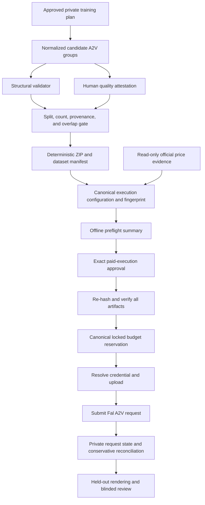

# Immutable Fal A2V Execution Bundle

**Status:** implementation authorized by the user’s standing instruction; paid execution remains conditional on every gate

**Decision:** continue with Fal-managed LTX 2.3 A2V training from this Windows PC

**Provider endpoint:** `fal-ai/ltx23-trainer-v2/a2v`

**Paid execution authorized by this document:** none
**Pilot cap:** $12.0000 total committed provider spend

## 1. Purpose

The pilot needs to test whether a private character LoRA can produce supplied-audio talking-head video that survives a strict real-versus-AI review. The first A2V output failed that bar: the face texture and speech motion remained visibly synthetic. The next paid run must therefore be protected against avoidable data, configuration, approval, and budget mistakes.

This design replaces an arbitrary ZIP upload with an immutable execution bundle. The bundle proves, before any credential is read or any file is uploaded, that:

- the exact training groups passed structural checks;
- a human reviewed every candidate against the speaking-footage quality contract;
- the training and held-out splits meet the approved count and separation rules;
- the ZIP, manifest, Fal request configuration, and validation assets are cryptographically bound together;
- the user explicitly approved those exact artifacts and cost ceilings;
- the one canonical pilot ledger can reserve the request without exceeding $12.0000; and
- no authenticated provider operation or paid side effect occurs when any offline or pre-submit gate fails.

This design reduces the chance of wasting the remaining budget. It does not guarantee photorealism, identity fidelity, natural visemes, or an indistinguishable result. Those remain empirical outcomes that must be judged from rendered video.

## 2. Decision context

Fal-managed training is the selected deployment path because this PC does not have a supported local CUDA training environment. The official LTX trainer recommends Linux with CUDA and an NVIDIA GPU with 80 GB or more VRAM for the standard configuration, with a lower-VRAM path around 32 GB. Fal exposes the required A2V mode as a managed endpoint.

The Fal A2V endpoint conditions video generation on a start image plus supplied audio. The audio is frozen as conditioning while the model learns the target video motion. Fal currently prices this endpoint at $0.006 per step, making the planned 1,000-step run $6.0000. The live endpoint schema and price were rechecked on 15 July 2026.

The current conservative committed pilot total is $3.5409. The remaining $8.4591 is allocated as follows:

| Item | Maximum committed cost |
|---|---:|
| 1,000-step A2V training | $6.0000 |
| External post-training validation | $1.2500 |
| Unspent safety buffer | $1.2091 |
| **Hard pilot total** | **$12.0000** |

The optional extra $2 contingency is not authorized. It requires a new explicit user instruction and a new versioned approval record after the original cap is reached.

## 3. Goals

The implementation must:

1. accept a directory of normalized A2V groups, never an arbitrary prebuilt upload ZIP;
2. separate machine-verifiable structure from human quality judgment;
3. require at least 10 accepted training groups and 5 accepted held-out groups;
4. package only accepted training groups into a reproducible ZIP;
5. hash every bundle input and bind it to one exact Fal request configuration;
6. require an exact, structured paid-execution approval instead of searching prose for marker strings;
7. perform a complete offline preflight in dry-run mode;
8. resolve the Fal credential only after every offline gate and budget reservation succeeds;
9. enforce one cumulative $12.0000 ledger across processes on Windows and POSIX systems;
10. fail closed on stale, altered, missing, ambiguous, or unapproved state; and
11. keep all source media, private manifests, approvals, provider URLs, request IDs, and weights out of Git.

## 4. Non-goals

This design does not:

- claim that 10 training groups are sufficient to reach the requested visual quality;
- claim that 1,000 steps are optimal;
- automatically determine whether a face looks real or whether speech motion is natural;
- replace native-speed human review or the blinded real-versus-generated test;
- authorize a second training run, automatic retraining, or automatic use of the extra $2;
- create a general multi-customer training control plane;
- self-host the LTX base model on this PC; or
- publish source footage, the LoRA, private configuration, or provider metadata.

## 5. Standing authorization and two execution gates

The user explicitly instructed the agent to implement the plan without another approval prompt, continue with Fal-managed training, and never exceed the fixed pilot cap. That instruction is recorded privately as a standing authorization policy. It removes repeated chat prompts; it does not remove the data, artifact, cost, or one-time execution gates.

The private policy contains a policy ID, SHA-256 of the user-provided authorization source, creation time, scope, endpoint allowlist, one permitted 1,000-step training request, $6.0000 training ceiling, $1.2500 validation allocation, $12.0000 cumulative cap, and an explicit prohibition on automatic cap extension. The policy contains only a hash of the source instruction, never its private contents.

The workflow then has two technical gates. They must not be conflated.

### 5.1 Preparation approval

The private `plan.md` describes the mode, assumptions, dataset work, 1,000-step configuration, validation method, and cost envelope. The standing authorization policy approves that fixed plan for dataset extraction, normalization, caption review, and bundle preparation. It does not by itself authorize a Fal upload or paid request.

This gate preserves the `train-model` invariant that captioning, preprocessing, and training do not begin before plan approval.

### 5.2 Paid-execution approval

After preparation produces the exact archive, manifest, execution configuration, and validation assets, a separate offline approval tool verifies that the bundle fits the standing policy and issues a structured one-time approval record. Only that exact record can authorize upload and submission.

The paid execution command cannot create its own standing policy or approval record. Approval must already exist and must match every artifact byte-for-byte.

The threat model is accidental spend, stale artifacts, tampering, replay, and concurrent execution by cooperative local processes. A malicious administrator who can rewrite the private policy, code, database, and operating system is outside scope; detached signing keys would be required for that threat model.

## 6. Architecture



Every box before “Resolve credential and upload” is non-billable. The only permitted network access is the unauthenticated read of the public official price page; all other preflight work is offline. Unit and integration tests replace the credential resolver, uploader, and submitter with spies and must prove that all three remain untouched when a pre-submit gate fails.

## 7. Private run layout

All mutable or identifying artifacts live in the private run workspace, not in the public repository:

```text
run/
  plan.md
  candidates/
    sample_001_start.png
    sample_001_audio.wav
    sample_001_end.mp4
    sample_001.txt
  control/
    standing-authorization.json
    price-evidence.json
    structural-report.json
    quality-attestation.json
    execution-config.json
    execution-approval.json
    preflight-report.json
  bundle/
    training-data.zip
    dataset-manifest.json
    bundle-manifest.json
  validation/
    provider-validation-selection.json
  outputs/
    provider-request.json
    training-result.json
    lora.safetensors
    inference-config.json
  logs/
```

All accepted holdout groups remain in `candidates/` with their four synchronized files, including each genuine `_end.mp4` target required for later blind comparison. The structural report, quality attestation, dataset manifest, and root bundle manifest hash-bind all four files for every holdout while keeping them outside the training ZIP. `provider-validation-selection.json` identifies exactly two accepted holdout group IDs; it does not duplicate or replace the local assets. The canonical pilot ledger is outside an individual run so a new run cannot reset cumulative spend. Its state directory is deployment configuration, not a command-line argument.

## 8. Normalized A2V group contract

Each candidate uses one neutral ASCII group ID and exactly four files:

```text
sample_001_start.png
sample_001_audio.wav
sample_001_end.mp4
sample_001.txt
```

The normalized internal format is intentionally narrower than the formats Fal accepts:

| Artifact | Required normalized form |
|---|---|
| Start image | RGB PNG, exactly 544×960 |
| Conditioning audio | WAV, PCM signed 16-bit, mono, 48 kHz, timestamp zero |
| Target video | MP4, exactly 544×960, constant 24 fps, exactly 89 frames, timestamp zero, no audio stream |
| Caption | non-empty UTF-8 text, no managed trigger token |

The target video and conditioning audio must be derived from the same real speaking interval. The start image must be the exact decoded first RGB frame of the target video.

## 9. Structural validation

The structural validator is deterministic and makes no subjective quality claim. For every candidate it verifies:

- the group ID matches the allowed ASCII pattern;
- all four required files exist and no extra file or directory is present in the candidate root;
- no file is a symlink, device, or path traversal;
- each media file has exactly the expected stream count and codec/container form;
- image and video dimensions are 544×960;
- the video has exactly 89 decoded frames and is constant 24 fps;
- audio is mono PCM signed 16-bit at 48 kHz;
- video and audio both start at timestamp zero;
- the absolute A/V duration difference is at most one frame, or 1/24 second;
- the SHA-256 of the decoded first RGB frame matches the start image’s decoded RGB pixels;
- the caption is non-empty UTF-8 and does not already contain the managed trigger token;
- the audio is not digital silence; and
- all input bytes are hashed and recorded.

The non-silence check is only a guard against an empty or all-zero audio track. It does not prove speech, correct language, clean recording, or synchronization.

Structural output is a versioned JSON report containing relative filenames, media facts, decoded-frame hashes, file SHA-256 values, and explicit pass/fail reasons. It contains no absolute local path.

## 10. Human quality attestation

Machine checks cannot establish that the subject is visibly speaking, the framing is useful, or the source has no distracting edit. A reviewer must therefore attest every candidate in `quality-attestation.json`.

The document uses exact JSON fields rather than free-form prose:

```json
{
  "schema_version": "a2v-quality-attestation-v1",
  "dataset_id": "character-speech-pilot",
  "rights_and_consent": {
    "confirmed": true,
    "reviewer_id": "operator-1",
    "reviewed_at_utc": "2026-07-15T00:00:00Z"
  },
  "groups": [
    {
      "group_id": "sample_001",
      "split": "train",
      "accepted": true,
      "source_asset_id": "asset-001",
      "source_session_id": "session-001",
      "location_id": "location-001",
      "source_start_ms": 1000,
      "source_end_ms": 4708,
      "checks": {
        "one_visible_speaker": true,
        "close_or_medium_close_framing": true,
        "face_mouth_jaw_cheeks_and_eyes_unobstructed": true,
        "continuous_real_speech_motion": true,
        "no_internal_cut": true,
        "no_overlapping_speaker_dubbing_or_music": true,
        "no_watermark_burned_captions_or_beauty_filter": true,
        "audio_and_video_are_from_the_same_interval": true,
        "rights_and_likeness_use_confirmed": true,
        "teeth_or_inner_mouth_visible": false
      },
      "notes": "Accepted for the planned split."
    }
  ]
}
```

For an accepted group, every check except `teeth_or_inner_mouth_visible` must be `true`. Teeth/inner-mouth visibility is recorded as coverage information, not asserted as a universal per-clip requirement. The preflight report surfaces how many accepted training and held-out groups contain that coverage. At least one held-out group used in the evaluation matrix must have it.

Rejected candidates remain in the attestation with `accepted: false` and a reason in `notes`, but they never enter the ZIP. Missing groups, duplicate group IDs, unknown fields, malformed timestamps, a false global rights confirmation, or an accepted group with a required false check fail the gate.

## 11. Split and provenance gate

The bundle builder accepts only groups that passed both validation layers. It enforces:

- at least 10 accepted `train` groups;
- at least 5 accepted `holdout` groups;
- no group assigned to more than one split;
- no exact media hash duplicated within or across splits;
- no overlapping source intervals for the same opaque `source_asset_id` across train and holdout;
- no `source_session_id` assigned across both train and holdout, including re-encodes or alternate crops from the same recording session;
- at least two held-out groups use `location_id` values absent from the training split when the result is described as an unseen-location test;
- exactly two approved holdout image/audio pairs selected for Fal’s built-in validation; and
- all remaining held-out groups excluded from the training ZIP.

The count and split isolation are approved stop-before-spend rules, not predictions that the resulting LoRA will meet the visual bar. If the available data cannot support location-isolated holdouts, the run must not claim unseen-location performance.

## 12. Deterministic archive and dataset manifest

The builder creates `training-data.zip` itself. Execute mode never accepts a user-supplied ZIP.

Archive rules:

- lexical member order;
- relative root filenames only;
- no directory entries, comments, symlinks, extra fields, or platform-specific metadata;
- fixed ZIP timestamps and permissions;
- `ZIP_STORED` members, because the video and image inputs are already compressed and byte stability is more valuable than recompression;
- write to a temporary file, flush, then atomically replace the final archive; and
- reopen the final archive and verify every member before declaring success.

The verifier also rejects absolute paths, `..` traversal, symlinks, duplicate names, case-colliding names, encrypted members, unexpected compression methods, excess member count, excess uncompressed size, and suspicious compression ratios. These checks remain mandatory even though the archive is locally generated, because they protect against later replacement or corruption.

`dataset-manifest.json` contains:

- `schema_version` and `dataset_id`;
- the normalized A2V specification;
- approved training and holdout counts;
- a sorted list of training member names, sizes, and SHA-256 values;
- the accepted holdout group hashes without adding them to the ZIP;
- the SHA-256 of the structural report and quality attestation;
- the final archive byte size and SHA-256; and
- the archive builder version.

The manifest is not placed inside the ZIP because Fal’s dataset root should contain only the expected training group files. The approval record binds the manifest file itself.

`bundle-manifest.json` is the root content-addressed object. It contains the hashes and sizes of the approved plan, standing authorization policy, structural report, quality attestation, dataset manifest, training ZIP, execution configuration, and every local validation and held-out asset. It also contains a one-time `execution_id`, builder version, validator version, repository commit, creation time, and expiry time.

The digest domain is the canonical JSON bytes of the root manifest excluding only a `bundle_id` field, which is never serialized into the hashed object. The manifest does not include the later approval record, preflight report, ledger, provider state, logs, or outputs. Canonical JSON version 1 applies to the root manifest as well as the request configuration. Execute mode allowlists exact supported schema, builder, and validator versions; an older or unknown version fails closed. SHA-256 of the canonical root bytes is the `bundle_id` used by the one-time paid-execution approval.

## 13. Canonical execution configuration

`execution-config.json` is the only source of request parameters. The runner does not accept command-line overrides for paid execution.

Version 1 fixes the following request:

| Field | Value |
|---|---:|
| Endpoint | `fal-ai/ltx23-trainer-v2/a2v` |
| Rank | 32 |
| Steps | 1,000 |
| Learning rate | 0.0002 |
| Training frames / fps | 89 / 24 |
| Resolution / aspect | high / 9:16 |
| Auto-scale input | false |
| Split input into scenes | false |
| Audio normalization | true |
| Preserve audio pitch | true |
| Debug dataset | false |
| Validation entries | exactly 2 |
| Validation frames / fps | 89 / 24 |
| Validation resolution / aspect | high / 9:16 |
| Maximum training cost | $6.0000 |
| Maximum external validation cost | $1.2500 |
| Cumulative pilot cap | $12.0000 |

The exact neutral trigger token, prompts, negative prompt, validation filenames, local validation hashes, dataset-manifest hash, archive hash, one-time execution ID, pricing rate, pricing source URL, and pricing-evidence hash are also stored privately in this file.

Before bundle issuance, a separate read-only price-evidence tool fetches the public official Fal model page without a credential, captures the authoritative response hash and retrieval time, and verifies that the page still states the expected $0.006-per-step formula and $6.0000 cost for 1,000 steps. This network read cannot create provider spend. Paid execution requires evidence no more than 24 hours old; a fetch or parse failure, or any rate change, blocks bundle issuance and execution.

Canonical JSON version 1 uses sorted object keys, UTF-8, no insignificant whitespace, integers for integral values, booleans for flags, and strings for decimal money and learning-rate values. Parsers reject duplicate keys, unknown fields, non-finite numbers, and alternate encodings. SHA-256 of those bytes is the execution configuration fingerprint. Runtime conversion to the Fal API schema occurs only after fingerprint verification.

## 14. Structured execution approval

`execution-approval.json` must contain exactly:

- `schema_version: a2v-execution-approval-v1`;
- a unique `approval_id`;
- `status: approved_for_paid_execution`;
- `approval_mode: standing_policy`;
- the standing authorization policy ID and SHA-256;
- an opaque issuer process ID and UTC timestamp;
- the full `bundle_id` and its one-time `execution_id`;
- an approval expiry time;
- SHA-256 of the approved private `plan.md`;
- SHA-256 of `dataset-manifest.json`;
- SHA-256 of `training-data.zip`;
- the execution configuration fingerprint;
- the canonical `pilot_id` and `ledger_id`;
- exact ceilings of $6.0000 training, $1.2500 validation, and $12.0000 cumulative spend; and
- exact approval of 1,000 A2V steps.

Any absent or extra field, any status other than the exact approved value, or any mismatch fails closed. Searching Markdown for phrases is prohibited. The runner cannot repair, regenerate, or silently update a stale approval.

The separate offline approval tool is the only component allowed to create this record. It receives the private bundle directory and the full 64-character bundle ID as explicit input, recomputes the bundle, verifies the standing policy and every ceiling, prints the complete sanitized summary, and issues the receipt only when the fixed policy matches exactly. It cannot access credentials, reserve budget, upload, or submit. The paid runner can verify the receipt but cannot invoke the issuer implicitly.

The standing policy is grounded in the user’s explicit “implement the plans” instruction and is sufficient for this single-operator pilot without another chat round-trip. This mechanism protects against accidental or stale execution, not a malicious local administrator. A later change to the plan, data, archive, validation assets, request parameters, pricing evidence, or budget requires a new bundle ID and a new policy-compatible approval. An execution ID can be approved and submitted only once.

## 15. Offline preflight

Dry-run is the default mode. It performs the same offline verification used by execute mode:

1. verify the approved preparation plan exists;
2. re-run structural validation;
3. validate the human quality attestation;
4. verify split counts, provenance, and holdout separation;
5. rebuild or byte-verify the deterministic ZIP;
6. safely inspect the ZIP and verify every manifest hash and archive member;
7. verify validation asset hashes, configuration fingerprint, pricing freshness, and root bundle ID;
8. validate the exact execution approval, expiry, and one-time execution ID, when supplied;
9. open the canonical ledger read-only and calculate remaining budget and replay status; and
10. emit `preflight-report.json` with one status per gate.

The paid command accepts only a private bundle directory, the full expected bundle ID, and an explicit execute switch. It does not accept individual dataset, endpoint, step, trigger, validation, pricing, ledger, or budget overrides. Path resolution rejects symlinks, Windows reparse points, absolute archive members, and any escape from the approved private run root.

Preflight extracts the exact final ZIP into a new private temporary directory, reruns structural validation on those extracted bytes, and compares the fresh report with the bound manifest. This proves that the object about to be uploaded—not merely an earlier source directory—satisfies the structural contract.

Dry-run returns a nonzero exit code if any required gate fails. It never reports a validation count based only on a path’s existence. It does not import or instantiate the Fal client, read `FAL_KEY`, upload a file, reserve money, or create provider request state.

Before the one-time receipt exists, dry-run may produce a complete `ready_for_policy_issuance` report. After the offline approval tool issues a matching receipt, the same command can produce `ready_for_paid_execution`. Neither state triggers a provider call.

## 16. Canonical budget ledger and transactions

Execute mode has no `--budget`, `--budget-state`, or cap-override argument.

The private deployment configuration resolves one canonical pilot-state directory in platform-local application data. The ledger is a SQLite database addressed by the fixed pilot ID, never by a caller-supplied path. Execute mode requires an existing database with:

- the expected `pilot_id` and `ledger_id`;
- `cap_usd` exactly `12.0000`;
- an exact reviewed migration manifest for every pre-SQLite entry, including its opaque ID, amount, status, and source-ledger hash;
- an append-only event history whose hash chain and derived committed total reproduce the known conservative $3.5409 migration total plus every later event;
- valid, uniquely identified entries and schema version;
- a successful SQLite `PRAGMA integrity_check`; and
- no prior reservation or submission for the approved bundle ID or execution ID.

A missing ledger is an error in execute mode; it is never created as an empty $12 ledger. Initial creation and one-time import of the reviewed migration manifest are separate explicit administrative actions, and the original JSON ledger is retained read-only as migration evidence. A different working directory cannot change the database location. The paid-execution approval binds the ledger identity and current event-chain head.

Every reservation or state transition uses a SQLite `BEGIN IMMEDIATE` transaction, a finite busy timeout, a fixed schema, foreign keys, uniqueness constraints, and durable commit. This provides one cross-process serialization mechanism on Windows and POSIX without a custom lock-file protocol. A uniqueness constraint on `(bundle_id, execution_id)` blocks replay.

Reservation states are:

| State | Counts against cap | Meaning |
|---|---:|---|
| `reserved` | yes | request amount held before network access |
| `uploading` | yes | local artifacts passed final hash verification and upload began |
| `submit_started` | yes | submit began and the outcome may be uncertain |
| `submitted` | yes | a provider request ID was persisted |
| `consumed` | yes | a provider job completed or billing was confirmed |
| `released` | no | it is proven that no billable request was created |

State transitions append events rather than editing prior history, are idempotent, and advance a SHA-256 event chain inside the same transaction. A crash never silently releases a reservation. `submit_started` without a durable provider request ID remains committed and may not be retried automatically; explicit provider reconciliation must prove that no job exists and append a release event.

The $6.0000 training reservation is acquired and committed inside one immediate transaction before the credential is resolved or any upload begins. The $1.2500 figure is only a reserved allocation for later validation; it does not authorize any inference request. Every paid validation render requires its own content-addressed validation bundle and policy-issued receipt binding the trained LoRA hash, input image/audio, prompt, endpoint, projected cost, and cumulative ledger state.

## 17. Paid execution boundary

Only after a second full preflight succeeds does execute mode:

1. acquire and persist the $6.0000 reservation;
2. copy the approved ZIP and validation assets into a fresh content-addressed staging directory named by the bundle ID, using create-new semantics;
3. open every staged file, verify its file identity, exact size, and SHA-256, then retain a deny-write/delete handle while it is uploadable;
4. on Windows, use a `CreateFileW` handle that permits shared reads but denies write and delete sharing; on POSIX, use a private current-user-only staging directory, read-only files, retained descriptors, and cooperative advisory locks;
5. lazily resolve the Fal credential;
6. transition the reservation to `uploading` and upload those exact staged paths while the retained handles prevent cooperative replacement;
7. verify the same file identities, sizes, and SHA-256 values again after upload and stop before submit if any value changed;
8. substitute returned private URLs into an in-memory request payload;
9. persist a sanitized submit-intent record and durably commit the `submit_started` event before the network submit call;
10. submit exactly `fal-ai/ltx23-trainer-v2/a2v` once;
11. persist the provider request ID privately as soon as it is available and transition to `submitted`;
12. poll or resume through Fal’s queue interface; and
13. mark the reservation consumed once completion or billing is established.

The uploader must read the staged content-addressed path protected by the retained handles; it may not reopen a mutable source path. This closes the normal accidental rename, replacement, and modify-during-upload cases. Protecting against a malicious administrator or kernel-level writer remains outside the stated threat model.

If Fal documents an idempotency key for this endpoint at execution time, the one-time execution ID is supplied as that key. If it does not, ambiguous submissions are never retried automatically.

Provider URLs, credentials, request IDs, and raw logs must pass through redaction before console output. The full private request state is stored only in the run workspace.

## 18. Failure behavior

| Failure | Required behavior |
|---|---|
| Plan not approved for preparation | stop before dataset work |
| Structural or quality gate fails | stop; do not build an executable bundle |
| Fewer than 10 train or 5 holdout groups | stop; collect or wait for better footage |
| Archive or manifest changed | invalidate approval; no credential access |
| Configuration or validation asset changed | invalidate approval; no credential access |
| Missing, fresh, wrong, or corrupt ledger | stop; do not create or reset it |
| Budget reservation would exceed $12 | stop before credential access |
| SQLite busy timeout | stop; do not retry a paid request automatically |
| Upload fails while the durable state is `reserved` or `uploading` | append a sanitized failure event, clean staged artifacts, then append `released`; the absence of any committed `submit_started` event is the proof that submit never began |
| Artifact mutates during upload while no `submit_started` event exists | stop before submit, append the audit event, clean staging, and append `released` |
| Submit outcome is ambiguous | keep `submit_started`; do not resubmit automatically |
| Provider job fails after acceptance | keep cost committed unless provider billing evidence proves otherwise |
| Result download or hash verification fails | preserve request state and resume retrieval; do not retrain automatically |

All errors identify the failed gate without printing credentials, signed URLs, private absolute paths, or source filenames beyond neutral group IDs.

## 19. Testing strategy

No automated test may call Fal or require a real credential.

### 19.1 Structural tests

- accept a fully normalized structural fixture without claiming it is quality footage;
- reject missing or unexpected files;
- reject symlinks and path traversal;
- reject wrong dimensions, frame count, fps, sample rate, channel count, codec, or timestamp;
- reject A/V duration drift greater than one frame;
- reject a start image that differs by one decoded pixel;
- reject digital silence;
- reject empty captions and captions containing the managed trigger token; and
- prove all report hashes match the bytes inspected.

### 19.2 Quality and split tests

- reject absent, malformed, duplicate, or extra attestation fields;
- reject a false global rights/consent confirmation;
- reject an accepted group with a required false check;
- exclude rejected groups from the ZIP;
- reject fewer than 10 accepted training groups or 5 accepted holdouts;
- reject exact duplicates and overlapping source intervals across splits; and
- reject a source recording session assigned across train and holdout;
- verify unseen-location claims only when held-out location IDs are absent from training; and
- require one held-out teeth/inner-mouth coverage case for the evaluation matrix.

### 19.3 Bundle and approval tests

- two builds from identical inputs produce the same archive bytes and hash;
- archive members are sorted and contain no extra metadata;
- traversal, absolute paths, symlinks, duplicate or case-colliding names, encryption, and ZIP-bomb limits fail;
- a one-byte post-build mutation fails verification;
- a stale or altered manifest fails;
- a configuration or validation-asset change invalidates the fingerprint;
- stale, missing, malformed, or changed official price evidence blocks issuance;
- a standing policy for a different endpoint, execution count, cost, or cap blocks issuance;
- `not_approved`, a prose marker file, and an approval for different hashes all fail;
- an exact structured approval passes; and
- execute mode cannot generate its own approval.

### 19.4 Budget and process tests

- execute mode rejects a missing or fresh ledger;
- a wrong `pilot_id`, `ledger_id`, cap, migration manifest, event-chain head, or integrity check fails;
- no command-line ledger or cap override exists;
- concurrent processes cannot reserve more than the remaining cumulative budget;
- SQLite busy timeout fails closed;
- crash recovery preserves ambiguous reservations;
- finalization is idempotent; and
- replay of the same bundle or execution ID is blocked; and
- a second 1,000-step run is blocked without a new approval and available budget.

### 19.5 No-side-effect integration tests

For every offline preflight failure, spies prove zero calls to:

- budget reservation;
- secret resolution;
- file upload;
- request submission; and
- provider polling.

Dry-run with invalid paths or stale inputs must fail rather than print a successful-looking summary. A successful dry-run must verify every artifact and leave the ledger byte-for-byte unchanged.

Additional integration tests mutate, rename, and replace an artifact immediately before upload, during upload, and after upload. They verify that the uploader reads only the content-addressed staged path protected by the retained handle. Every case must either stop before submit or leave a conservative committed state; none may create an automatic retry.

### 19.6 Privacy tests

The public repository scan rejects:

- credentials or credential-shaped values;
- private Drive identifiers or links;
- personal names and copied chats;
- absolute private filesystem paths;
- provider request IDs or signed URLs;
- source footage, private manifests, approval records, LoRA weights, or inference configuration; and
- non-generic media metadata.

## 20. Migration from the current prototype

The existing unpublished prototype is preserved but cannot be used for paid execution until it is replaced or hardened as follows:

- replace arbitrary `--dataset` ZIP input with a normalized group directory and deterministic builder;
- replace substring-based Markdown approval with the structured hash-bound record;
- capture the user’s standing authorization as a private fixed-scope policy and issue receipts only through the separate offline policy tool;
- split structural validation from human quality attestation;
- add per-file, archive, manifest, plan, validation-asset, and configuration hashes;
- remove arbitrary `--budget-state`, `--budget`, step, and request-parameter overrides from execute mode;
- migrate once to the pre-existing canonical SQLite ledger and transactional reservations;
- add read-only official price evidence and content-addressed upload staging;
- make dry-run execute all offline gates rather than infer readiness from supplied paths;
- lazily cross the credential/network boundary only after reservation; and
- add the negative, tamper, concurrency, crash, and zero-network tests listed above.

No unrelated refactor is included.

## 21. Release criteria for the safety gate

The execution-bundle implementation is ready for a paid pilot only when:

1. all new and existing tests pass on Windows;
2. SQLite concurrency and durability tests pass on Windows and POSIX CI;
3. repeated bundle builds are byte-identical;
4. every negative fixture fails before credential access;
5. the public privacy scan reports zero prohibited findings;
6. the private offline report proves at least 10 accepted training groups and 5 accepted holdouts;
7. the private standing authorization policy matches the fixed preparation plan and current user instruction;
8. the separate offline policy tool has verified the exact bundle summary and issued a matching one-time paid-execution receipt;
9. the canonical ledger proves at least $6.0000 remains under the $12.0000 cap; and
10. no new provider spend has occurred before all nine preceding conditions are true.

Passing this gate authorizes one 1,000-step A2V request only. It does not make the LoRA production-ready.

## 22. Post-training quality decision

After training, the adapter is evaluated on unseen audio, location-isolated holdouts, close and medium-close framing, and at least one teeth/inner-mouth case. Each paid render receives a separate hash-bound validation bundle and one-time policy receipt, then is separately reserved within the $1.2500 allocation. The training receipt never authorizes an unbound future inference payload.

The candidate fails if reviewers can identify it as AI from face texture, beard or skin rendering, lip shapes, teeth, inner mouth, jaw and cheek deformation, eyes, expression timing, identity drift, or other temporal artifacts. Audio fidelity alone cannot pass the pilot.

The final decision is a blinded, randomized, native-speed comparison against genuine held-out footage. The result is reported as measured evidence, never as a guarantee of indistinguishability.

## 23. Public and private artifact policy

The public repository may contain:

- this design;
- implementation code and synthetic test fixtures;
- sanitized cost and evaluation reports;
- generic manifests for explicitly approved generated outputs; and
- generated evaluation videos after content and privacy review.

The public repository must not contain:

- source or held-out footage;
- face-reference images or voice recordings;
- private plans, attestations, dataset manifests, approvals, or ledgers;
- credentials, Drive links, local paths, signed URLs, or request IDs;
- LoRA weights or private inference configuration; or
- copied private communications or personal identifiers.

The request keeps `debug_dataset` disabled, so no returned debug archive is requested or downloaded. Enabling it later would require a new bundle, explicit policy amendment, and defined private retention. The runner never deletes original source media automatically; source retention or deletion is a separate explicit user decision.

## 24. Authoritative references

- [Fal LTX 2.3 A2V trainer and current price](https://fal.ai/models/fal-ai/ltx23-trainer-v2/a2v)
- [Fal LTX 2.3 A2V API schema](https://fal.ai/models/fal-ai/ltx23-trainer-v2/a2v/api)
- [Official LTX-2 trainer README](https://github.com/Lightricks/LTX-2/blob/main/packages/ltx-trainer/README.md)
- [Official LTX-2 dataset preparation guide](https://github.com/Lightricks/LTX-2/blob/main/packages/ltx-trainer/docs/dataset-preparation.md)
- [Official LTX-2 training modes](https://github.com/Lightricks/LTX-2/blob/main/packages/ltx-trainer/docs/training-modes.md)
